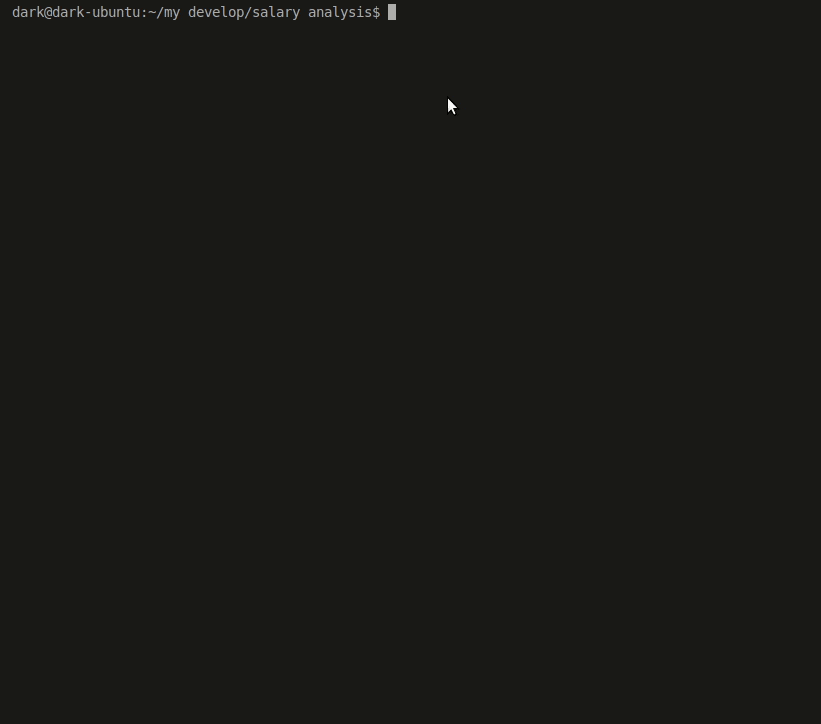

# Анализ вакансий для программиста на сайтах HeadHunter и SuperJob. 

Анализ производится среди вакансий в г. Москва для программиста специализирующегося по следующим ЯП :
Python, PHP, Java, JavaScript,Ruby, C++, Objective-C, Swift, Go, C#

## Пример работы:





## Перед первым запуском необходимо получить  Secret key для доступа к API SuperJob:


Зарегистрируйте приложение:

https://api.superjob.ru/register


В каталоге с приложением необходимо создать файл .env с содержимым:

`X_Api_App_Id=Secret key вашего приложения`


## Запуск


Python3 должен быть уже установлен. Затем используйте pip (или pip3, есть конфликт с Python2) для установки зависимостей: 

```
pip3 install -r requirements.txt

```


```

$python3 main.py

```


## Цель проекта

Код написан в образовательных целях на онлайн-курсе для веб-разработчиков dvmn.org.

2019 Dark_Dmake